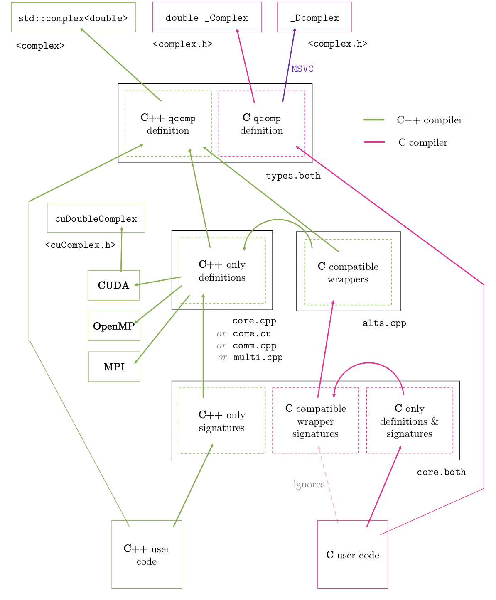

Our goal is to create a `C++` library which handles complex numbers aliased as `qcomp`, which can be used directly by both `C++` and `C` user codes.
The challenge is that while the `C++` library is compiled with `qcomp = std::complex<double>` (the type provided by `<complex>`), 
the `C` user's code will understand `qcomp` as a `double complex` (provided by `<complex.h>`).

Our requirements are:
- the library backend and the user codes all use the same type alias; `qcomp`
- the library backend is always compiled as `C++` by a `C++` compiler
- the library backend always understands `qcomp` as `std::complex<double>` (regardless of the user's language)
- a `C++` user can pass `qcomp`'s of underlying type `std::complex<double>` to/from the library
- a `C` user can pass `qcomp`'s of underlying type `double complex` to/from the library

This repo contains files:
- [`src/types.both`](src/types.both) which defines `qcomp = std::complex<double>` (`C++` type) or `qcomp = double complex` (`C` type)
- [`src/core.cpp`](src/core.cpp) which defines all backend functions using strictly `qcomp = std::complex<double>` (`C++` type). It includes all functions which are agnostic to `C` and `C++`, and functions only callable directly by `C++`.
- [`src/alts.cpp`](src/alts.cpp) defines `C`-compatible wrappers for the functions in `core.cpp` which are only directly callable by `C++`.
- [`src/core.both`](src/core.both) which declares only compiler-compatible functions to the parsing compiler. It defines `C`-only wrappers of `src/alt.cpp`'s C-compatible wrappers.
- [`main.cpp`](main.cpp) which is an example `C++` user's code
- [`main.c`](main.c) which is an example `C` user's code
- [`compile.sh`](compile.sh) which compiles both user's codes

The proposed solution assumes that `std::complex<double>` and `double complex` have identical layouts. 
- we first compile the backend in `C++` (wherein `qcomp` is the `C++` type)
- we compile the user's `C++` code, trivially, wherein `qcomp` is the `C++` type
- we compile the user's `C` code, wherein `qcomp` is the `C` type
- both user codes parse `core.both`, wherein `qcomp` is ambiguous
- `types.both` is parsed by both `C++` and `C`, which explicitly resolves `qcomp` to the compiler's native type
- backend functions which pass or return `qcomp` _by value_ can only be defined directly for `C++`. We must provide an alternate return-by-pointer which a `C` binary can safely call. These permittedly-name-mangled functions are replicated in code compiled only by `C`, by wrapping the alternate function.

In essence:
- user's code uses the native type of their language (`C` vs `C++`)
- the backend always uses the `C++` type
- the user's `C` code is "tricked" into believing the backend used the `C` type
- the `C` and `C++` binaries can exchange _pointers_ to `qcomp`
- the `C` and `C++` binaries cannot exchange `qcomp` _by value_; so `C++` defines functions with `qcomp` in the signature only for `C++` (name-mangling _on_), and provides alternate `C`-friendly versions which exchange pointers. The `C` compiler additionally prepares `C`-facing wrappers of these friendly versions, mimmicking the `C++` interface

The full architecture resembles:

> 

although it is easier understood if we remove the straightforward agnostic functions:

> 